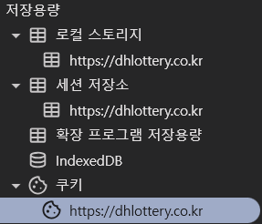

## Storage



### Cookie
- 자바스크립트에 의해 `로컬`에 저장되는 파일
  - 사용자의 로그인 정보를 저장하는 등 다양하게 활용
  - 로컬에 저장되기 때문에 요청속도가 비교적 빠르다.
  - ex `팝업창 - 오늘 다시보지 않기`, `아이디 비밀번호 자동입력`

- `문자열만` 저장 가능
- Session Cookie : 브라우저 종료 시 쿠키 삭제
  - 만료일을 포함하지 않는다. 
  - 브라우저가 열려있는 동안에만 저장된다. 이는 유저들의 자격증명을 하는데 사용될 수 있다(은행정보)

- Persistent Cooki : 만료일자를 지정하여 해당 일자에 삭제
  - 만료일을 가진다. 이 `cookie`는 만료일까지 유저의 디스크에 저장되고 만료일이 지나면 삭제된다. 유저들이 방문할때마다 유저 경험을 커스텀하기 위해 특정 웹사이트에서 행동을 기록하는 등 여러 활동들에 사용될 수 있다.

- 저장 용량 : 4KB

```JavaScript
// Session Cookie (키=값;)
document.cookie = 'key1=value1';
document.cookie = 'key2=value2';

// Persistent Cookie (키=값;expires=만료일자;)
document.cookie = 'key1=value1;';
documnet.cookie = 'key2=value2;expire=Sun, 01 Jan 2040 00:00:00 GMT';
```

### Session Storage
- 세션은 쿠키를 기반으로 하지만

  `쿠키`는 `사용자 웹 브라우저`에서 관리되고
  
  `세션`은 `서버`에서 관리된다.
  
  이는 로컬에서 저장되는 쿠키보다 보안적인 부분에서 우수하지만 요청 속도는 쿠키에 비해 떨어진다.

- 만료기간을 정할 수 있지만 브라우저 종료시 무조건 적으로 삭제된다.
- 저장용량 : 5MB 이상

```JavaScript
sessionStorage.setItem('key1','session value1');
sessionStorage.setItem('key2','session value2');
console.log(sessionStorage.getItem('key1'));
console.log(sessionStorage.getItem('key2'));
```

### Local Storage
- 세션과 비슷하지만 라이프 사이클이 다르다.

    `세션`은 브라우저를 종료하거나, 브라우저가 서로 다르거나, 도메인 마다 별도의 세션을 가져서 데이터의 `유효성`이 있지만

    `로컬스토리지`는 직접 지우지 않는다면 `별도의 만료기간이 없다` 는 큰 차이가 있다.

- 사용자의 로그인 정보를 저장하는 등 다양하게 활용
- 객체 저장 가능
- 저장용량 : 5MB 이상

```JavaScript
localStorage.setItem('key1', 'local value1');
localStorage.setItem('key2', 'local value2');
console.log(localStorage.getItem('key1'));
console.log(localStorage.getItem('key2'));
```